# Домашнее задание к занятию «1.2. Популярные языки, системы сборки, управления зависимостями»

## Студент: Максимов Сергей Алексеевич
Решение в конце README.md

## Задание SonarQube

На лекции мы с вами говорили, что исходный код приложения — это источник потенциальных уязвимостей.

Конечно же, исходный код приложения можно проверить и глазами, но при современных объёмах кода — это достаточно трудоемкая задача.

Поэтому существуют специальные инструменты, которые позволяют анализировать качество кода, в том числе пытаются найти в нём уязвимости.

С одним из подобных инструментов ([SonarQube](https://www.sonarqube.org/)) мы познакомимся в этом ДЗ, альтернативы рассмотрим на одной из следующих лекций.

**Важно**: вам не нужно учить Java и детально разбираться в коде. Ваши задачи:
1. Получить базовый опыт работы с инструментом.
1. Проанализировать предупреждения, баги и уязвимости.

### Описание проекта

Мы подготовили для вас учебный проект, написанный на языке Java и использующий систему сборки Maven.

Проект представляет собой веб-сервер, работающий на порту 8080 и отвечающий HTTP-запросам.

Страница http://localhost:8080/users.html закрыта логином и паролем admin/secret.

Чтобы собрать образ и запустить его (это необязательно для выполнения ДЗ), вам нужно:
1. Скачать [app.tgz](assets/app.tgz).
1. Скачать [Dockerfile](assets/Dockerfile).
1. Скачать [docker-compose.yml](assets/docker-compose.yml).
1. В каталоге со скачанными файлами выполнить: `docker-compose up --build ibdev`.

### Порядок выполнения

**Важно**: если вы планируете работать в Play With Docker, то используйте `tmux` или подключение по ssh для открытия нескольких терминалов. Или, если вы хорошо владеете консолью, переводите foreground процессы в background и обратно по мере необходимости.

0\. Скопируйте на целевую машину файл [docker-compose.yml](assets/docker-compose.yml) и откройте терминал в том же каталоге.

1\. Запустите сервис SonarQube:

```shell
docker-compose up sonarqube
```

Команда позволяет запустить только этот сервис и те, от которых он зависит (а не все перечисленные в `docker-compose.yml`).

2\. Дождитесь появления в логах записи `SonarQube is up`, после чего зайдите на http://localhost:9000 (или `docker-machine ip` и порт 9000, или на 9000 порту в Play With Docker).

3\. Для входа используйте следующие учётные данные:
* логин — `admin`
* пароль — `admin`

4\. На главной странице нажмите кнопку `Create new project`:

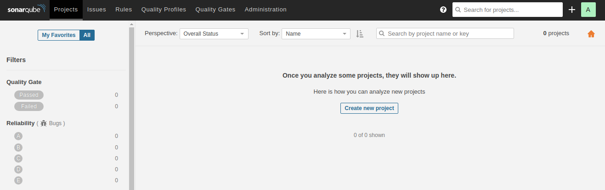

5\. Введите ключ проекта (это нечто вроде кода проекта) и нажмите кнопку `Setup`:

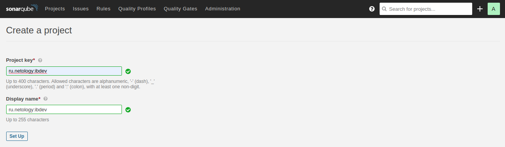

6\. Введите имя токена (ключа доступа) и нажмите на кнопку `Generate`:

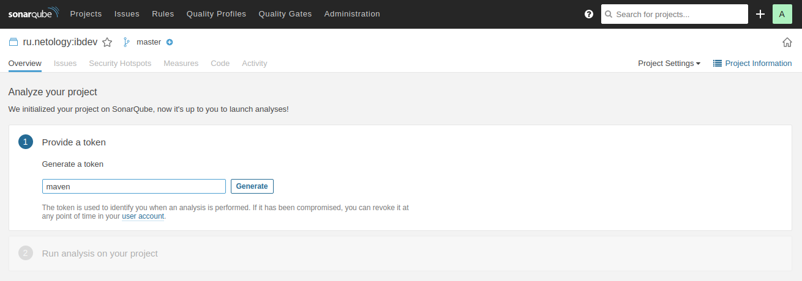

7\. После генерации токена нажмите на кнопку `Continue`:

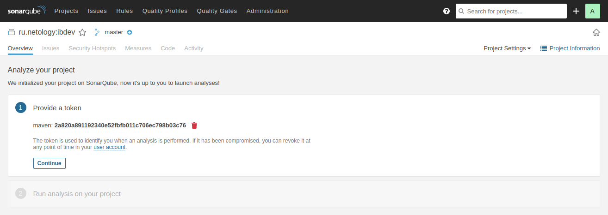

8\. Выберите опцию `Maven` и скопируйте сгенерированный код:

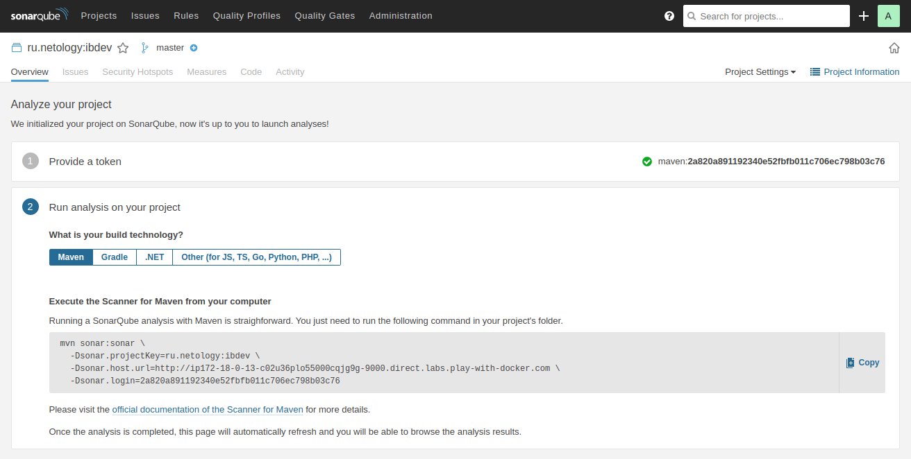

Необходимо скопировать вот этот код:
```
mvn sonar:sonar \
  -Dsonar.projectKey=ru.netology:ibdev \
  -Dsonar.host.url=http://ip172-18-0-13-c02u36plo55000cqjg9g-9000.direct.labs.play-with-docker.com \
  -Dsonar.login=2a820a891192340e52fbfb011c706ec798b03c76
```

И заменить в нём строку: `-Dsonar.host.url=http://ip172-18-0-13-c02u36plo55000cqjg9g-9000.direct.labs.play-with-docker.com \` на `-Dsonar.host.url=http://sonarqube:9000 \`.

Т. е. должно получиться:
```
mvn sonar:sonar \
  -Dsonar.projectKey=ru.netology:ibdev \
  -Dsonar.host.url=http://sonarqube:9000 \
  -Dsonar.login=2a820a891192340e52fbfb011c706ec798b03c76
```

Это сделано потому, что контейнер с SonarQube и Maven будут находиться в одной сети, созданной для них Docker Compose, в которой сетевой доступ к сервисам возможно осуществлять по их имени.

**Q**: что делает эта команда?

**A**: большинство систем сборки (мы используем Maven) расширяемы за счёт использования плагинов (специальных дополнений). В этом случае SonarQube предоставляет для Maven Plugin, который называется `sonar`, и его задача — интегрируясь в Maven, проанализировать проект и отправить результаты анализа в SonarQube.

**Важно**: это команда для sh. Т. е. вы можете её использовать в sh, bash, Cygwin Terminal. Если вы работаете в CMD или PowerShell, то уберите все `\` и переносы строки и пишите всё в одну строку.

9\. Откройте новый терминал в том же каталоге, где у вас расположен файл `docker-compose.yml`.

10\. Выполните следующие команды:

```shell
# скачиваем архив с приложением
wget https://raw.githubusercontent.com/netology-code/ibdev-homeworks/master/02_dev/assets/app.tgz
# распаковываем архив
tar -xvf app.tgz
```

11\. Запустите [контейнер со сборочной системой Maven](https://hub.docker.com/_/maven): 

```shell
docker-compose run maven mvn -f /app sonar:sonar \
      -Dsonar.projectKey=ru.netology:ibdev \
      -Dsonar.host.url=http://sonarqube:9000 \
      -Dsonar.login=2a820a891192340e52fbfb011c706ec798b03c76
```

Обратите внимание: начиная с `sonar:sonar` - это то, что вы скопировали на шаге 8, с тем изменением, что после `mvn` добавлена опция `-f /app`.

12\. Дождитесь появления сообщения об окончании процесса:

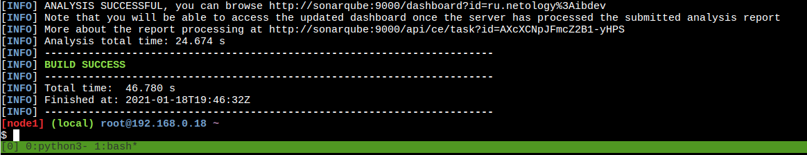

13\. Перейдите в веб-интерфейс SonarQube:

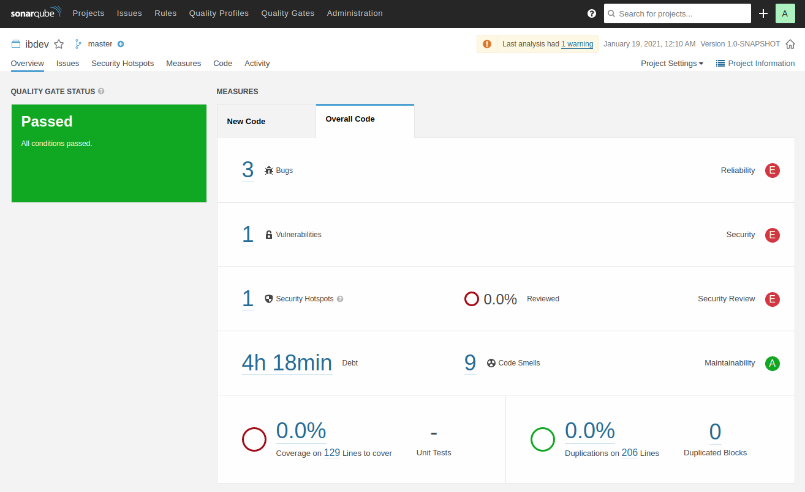

14\. Перейдите в раздел Bugs (ошибки в программном коде):

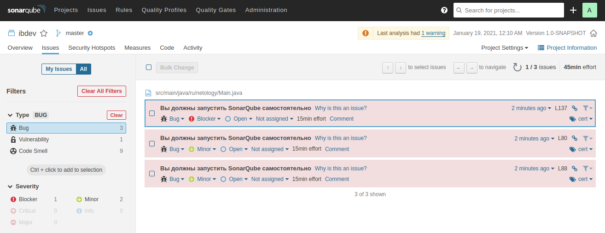

В этом разделе для каждой записи вы можете:
1. Изменить тип: Bug, Vulnerability, Code Smell.
1. Установить приоритет: Blocker — блокирует всю работу над продуктом, Critical — критичный, Major — важный, Minor — неважный, Info — информационное сообщение.
1. Статус: Open — открыт, Resolve as fixed — «закрыть» как исправлено, Resolve as false positive — «закрыть» как ложное срабатывание, Resolve as won't fix — «закрыть» как непланируемое к исправлению.
1. Увидеть примерную оценку по времени на исправление.
1. Установить комментарий.

15\. Перейдите в раздел Vulnerabilities (уязвимости в программном коде):

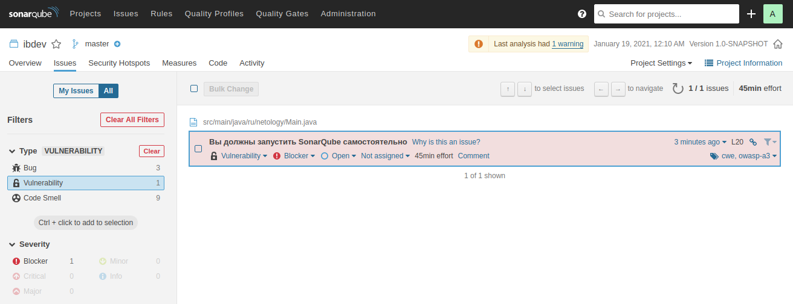

В этом разделе для каждой записи вы можете:
1. Изменить тип: Bug, Vulnerability, Code Smell.
1. Установить приоритет: Blocker — блокирует всю работу над продуктом, Critical — критичный, Major — важный, Minor — неважный, Info — информационное сообщение.
1. Статус: Open — открыт, Resolve as fixed — «закрыть» как исправлено, Resolve as false positive — «закрыть» как ложное срабатывание, Resolve as won't fix — «закрыть» как непланируемое к исправлению.
1. Увидеть примерную оценку по времени на исправление.
1. Установить комментарий.

16\. Перейдите в раздел Security Hotspots (код, требующий ручного анализа на предмет наличия уязвимости):

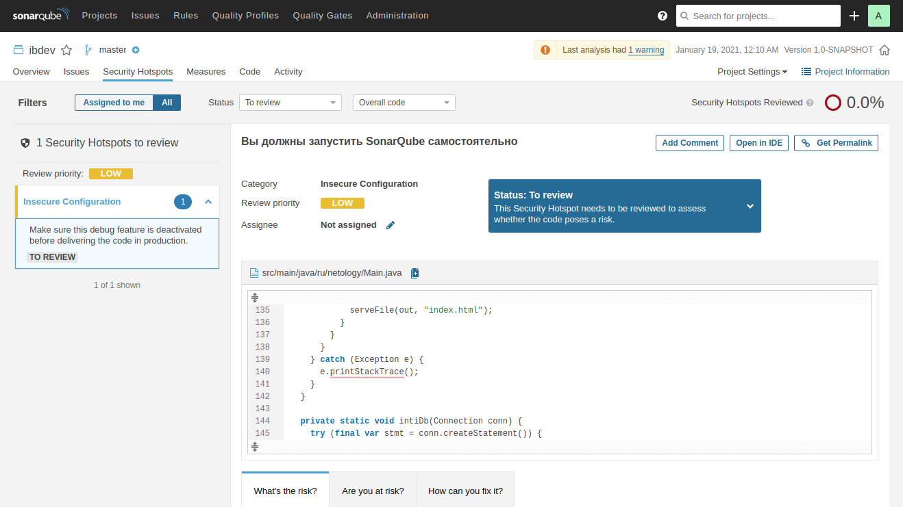

В этом разделе для каждой записи вы можете:
1. Выставить статус.
1. Назначить ответственного.

17\. Перейдите в раздел Code Smells (запахи кода — признаки плохого кода):

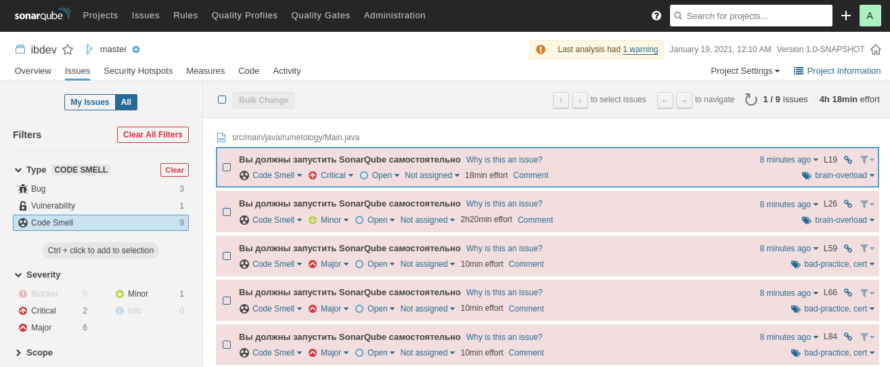

В этом разделе для каждой записи вы можете:
1. Изменить тип: Bug, Vulnerability, Code Smell.
1. Установить приоритет: Blocker — блокирует всю работу над продуктом, Critical — критичный, Major — важный, Minor — неважный, Info — информационное сообщение).
1. Статус: Open — открыт, Resolve as fixed — «закрыть» как исправлено, Resolve as false positive — «закрыть» как ложное срабатывание, Resolve as won't fix — «закрыть» как непланируемое к исправлению.
1. Увидеть примерную оценку по времени на исправление.
1. Установить комментарий.

### Результаты выполнения

Отправьте в личном кабинете студента ответы на следующие вопросы:
1. Какие баги были выявлены: количество, описание, почему SonarQube их считает багами? См. ссылку `Why is this an issue?`.
1. Какие уязвимости были выявлены: количество, категории, описание, почему SonarQube их считает уязвимостями?
1. Какие Security Hotspots были выявлены: количество, категории, приоритет, описание, почему SonarQube их считает Security HotSpot'ами?
1. К каким CWE идёт отсылка для Security Hotspots из п. 2? См. вкладку `How can you fix it?` в нижней части страницы.
1. Какие запахи кода были выявлены: количество, описание, почему SonarQube их считает запахами кода? См. ссылку `Why is this an issue?`.


### Решение

1. Был найден 1 баг. 
   * **Описание**: Introduce a new variable instead of reusing the parameter "clean" (Введите новую переменную вместо повторного использования параметра "clean"). 
   * **Почему SonarQube считает багом**: While it is technically correct to assign to parameters from within method bodies, doing so before the parameter value is read is likely a bug. Instead, initial values of parameters, caught exceptions, and for each parameters should be, if not treated as final, then at least read before reassignment. (Хотя технически правильно присваивать параметры из тела метода, выполнение этого до считывания значения параметра, скорее всего, является ошибкой. Вместо этого начальные значения параметров, перехваченные исключения и для каждого параметра должны если не рассматриваться как окончательные, то, по крайней мере, считываться перед переназначением.)
   * 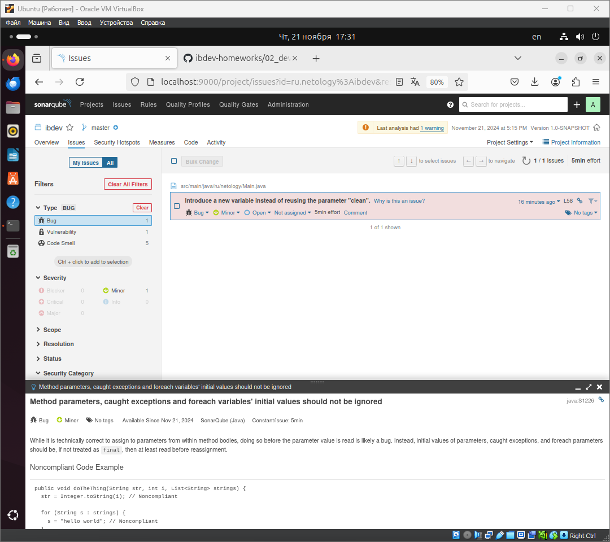
2. Была найдена 1 уязвимость.
    * **Описание**: Add password protection to this database. (Добавьте защиту паролем к этой базе данных.)
    * **Почему SonarQube считает уязвимостью**: Databases should always be password protected. The use of a database connection with an empty password is a clear indication of a database that is not protected. This rule flags database connections with empty passwords. (Базы данных всегда должны быть защищены паролем. Использование подключения к базе данных с пустым паролем является явным признаком незащищенности базы данных. Это правило помечает подключения к базе данных с пустыми паролями.)
    * 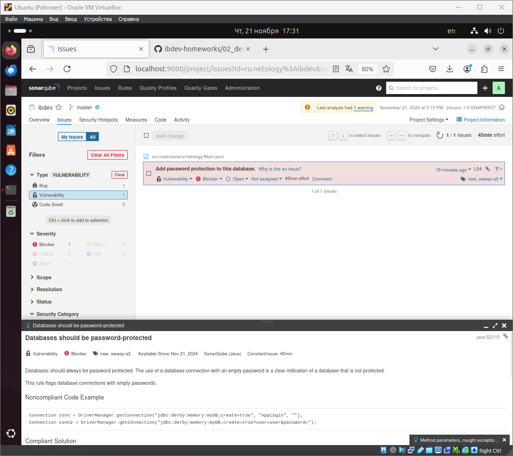
3. Был выявлен 1 Security Hotspots.
   * **Категория**: Insecure Configuration (Небезопасная конфигурация)
   * **Приоритет**: Low (Низкий)
   * **Описание**: Make sure this debug feature is deactivated before delivering the code in production. (Убедитесь, что эта функция отладки отключена, прежде чем отправлять код в рабочую среду.)
   * **Почему SonarQube считает Security Hotspots**: Delivering code in production with debug features activated is security-sensitive. It has led in the past to the following vulnerabilities: CVE-2018-1999007, CVE-2015-5306, CVE-2013-2006. An application's debug features enable developers to find bugs more easily and thus facilitate also the work of attackers. It often gives access to detailed information on both the system running the application and users. (Предоставление кода в рабочей среде с активированными функциями отладки связано с соображениями безопасности. В прошлом это приводило к появлению следующих уязвимостей: CVE-2018-1999007, CVE-2015-5306, CVE-2013-2006. Функции отладки приложений позволяют разработчикам легче находить ошибки и, таким образом, облегчают работу злоумышленников. Часто они предоставляют доступ к подробной информации как о системе, в которой запущено приложение, так и о пользователях.)
   * 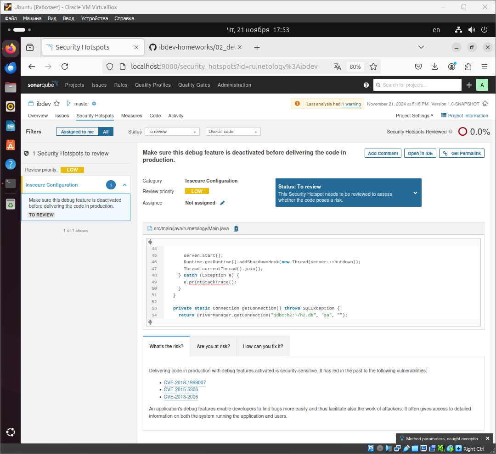
4. Для Security Hotspots из п. 2 идет отсылка к: 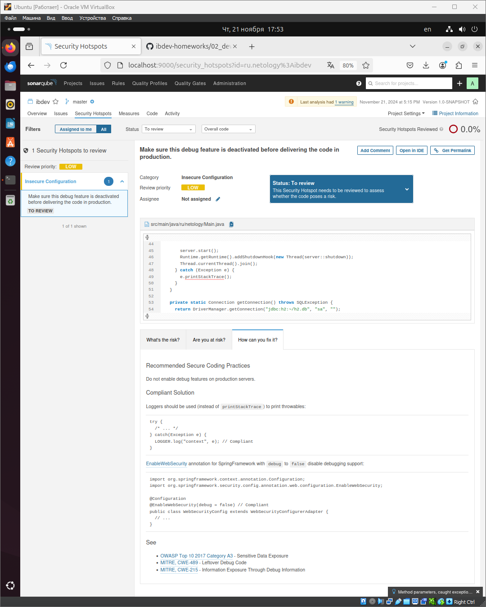
   * MITRE, CWE-489 - Leftover Debug Code (Оставшийся отладочный код)
   * MITRECWE-215 - Information Exposure Through Debug Information (Предоставление информации посредством Отладочной информации)
5. Был выявлен 5 Code Smell: 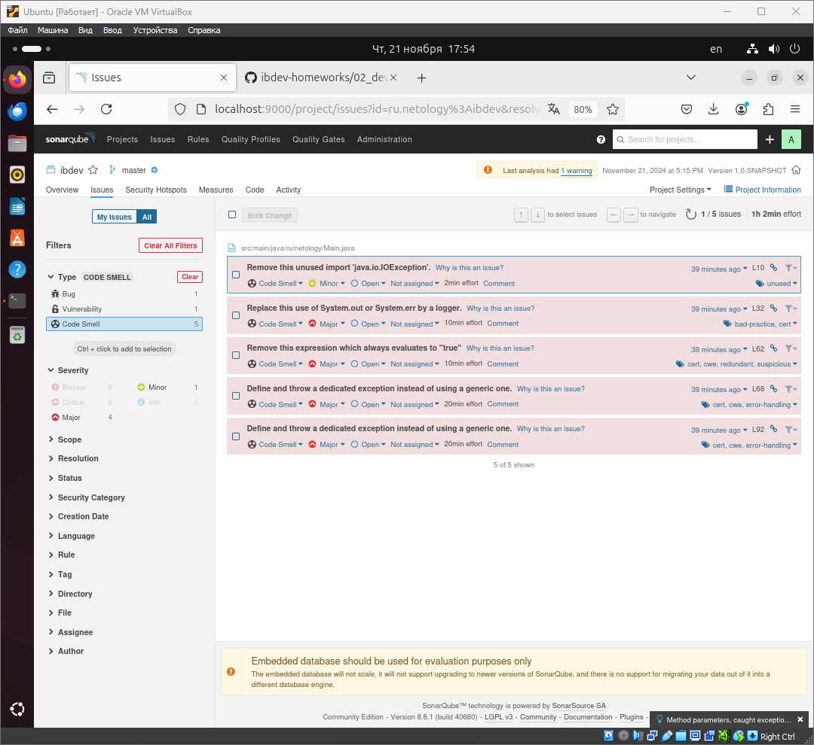
    1. * **Описание**: Remove this unused import 'java.io.IOException'. (Удалите этот неиспользуемый импорт 'java.io.IOException'.) 
       * **Почему SonarQube считает Security Hotspots**: The imports part of a file should be handled by the Integrated Development Environment (IDE), not manually by the developer. Unused and useless imports should not occur if that is the case. Leaving them in reduces the code's readability, since their presence can be confusing. (Импортируемая часть файла должна обрабатываться интегрированной средой разработки (IDE), а не разработчиком вручную. В этом случае неиспользуемый и бесполезный импорт не должен выполняться. Если оставить их включенными, это ухудшит читаемость кода, поскольку их присутствие может привести к путанице.)
       * 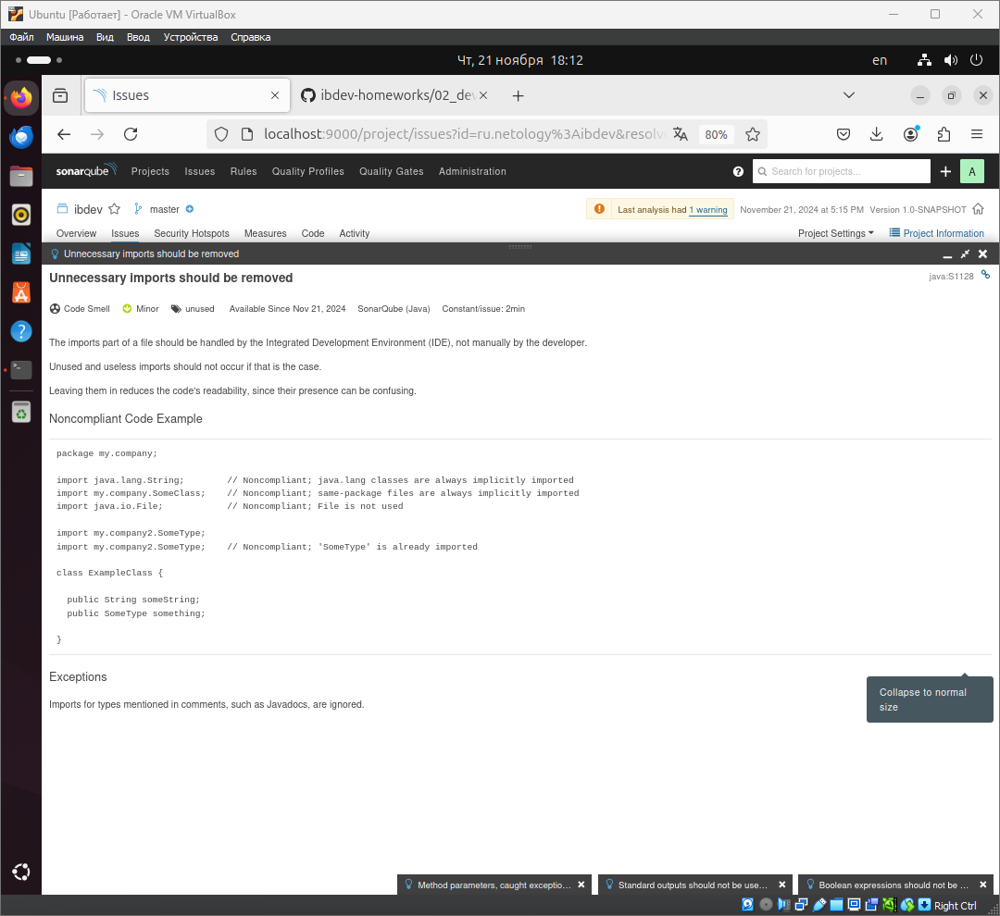
    2. * **Описание**: Replace this use of System.out or System.err by a logger. (Замените это использование System.out или System.err регистратором.)
       * **Почему SonarQube считает Security Hotspots**: When logging a message there are several important requirements which must be fulfilled: 1. The user must be able to easily retrieve the logs; 2. The format of all logged message must be uniform to allow the user to easily read the log; 3. Logged data must actually be recorded; 4. Sensitive data must only be logged securely. If a program directly writes to the standard outputs, there is absolutely no way to comply with those requirements. That's why defining and using a dedicated logger is highly recommended. (При регистрации сообщения необходимо выполнить несколько важных требований: 1. Пользователь должен иметь возможность легко извлекать журналы; 2. Формат всех зарегистрированных сообщений должен быть единообразным, чтобы пользователь мог легко читать журнал; 3. Зарегистрированные данные должны быть действительно записаны; 4. Конфиденциальность данные должны храниться только в защищенном виде. Если программа напрямую записывает данные в стандартные выходные данные, то нет абсолютно никакого способа выполнить эти требования. Вот почему настоятельно рекомендуется определить и использовать специальный регистратор.)
       * 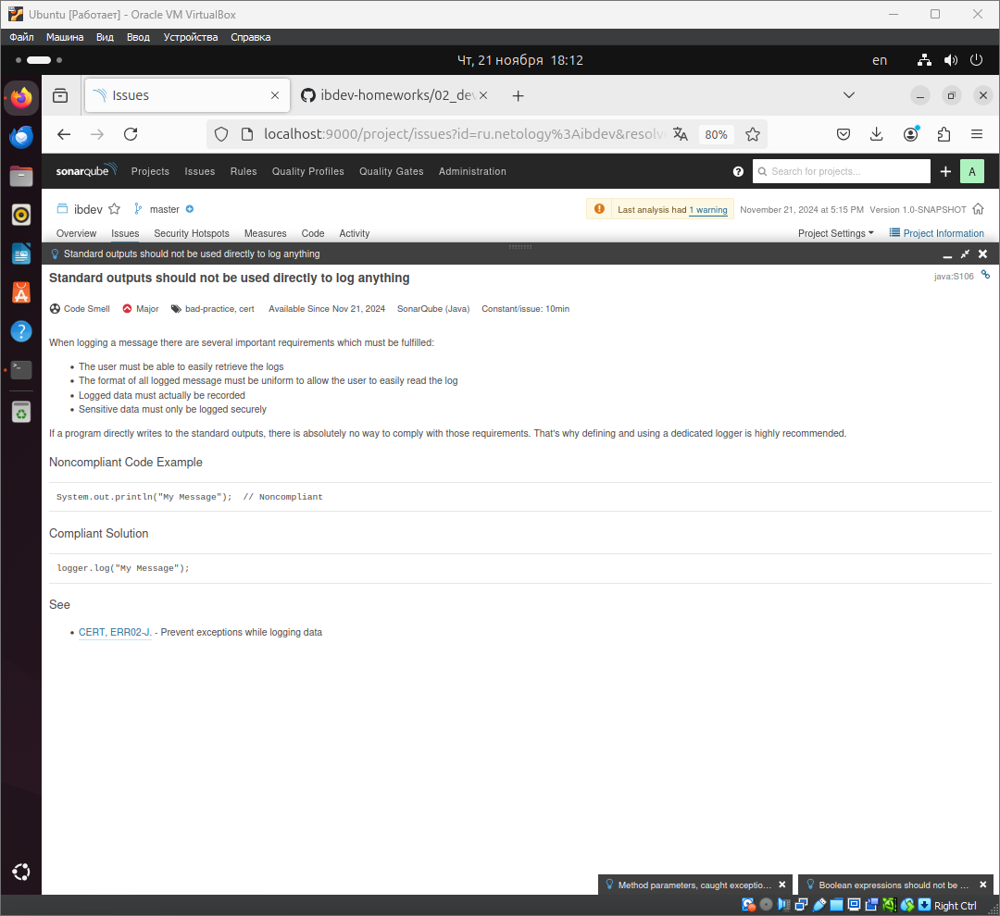
    3. * **Описание**: Remove this expression which always evaluates to "true" (Удалите это выражение, которое всегда принимает значение "true".)
       * **Почему SonarQube считает Security Hotspots**: If a boolean expression doesn't change the evaluation of the condition, then it is entirely unnecessary, and can be removed. If it is gratuitous because it does not match the programmer's intent, then it's a bug and the expression should be fixed. (Если логическое выражение не изменяет оценку условия, то оно совершенно не нужно и может быть удалено. Если оно не соответствует намерениям программиста, то это ошибка, и выражение следует исправить.)
       * 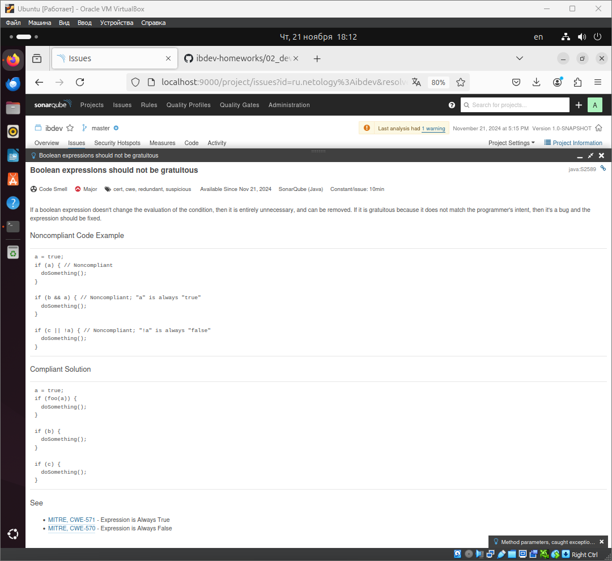
    4. * **Описание**: Define and throw a dedicated exception instead of using a generic one. (Определите и сгенерируйте специальное исключение вместо использования общего.) 
       * **Почему SonarQube считает Security Hotspots**: Using such generic exceptions as Error, RuntimeException, Throwable, and Exception prevents calling methods from handling true, system-generated exceptions differently than application-generated errors. (Использование таких универсальных исключений, как Error, RuntimeException, Throwable и Exception, не позволяет вызывающим методам обрабатывать истинные системные исключения иначе, чем ошибки, генерируемые приложением.)
       * 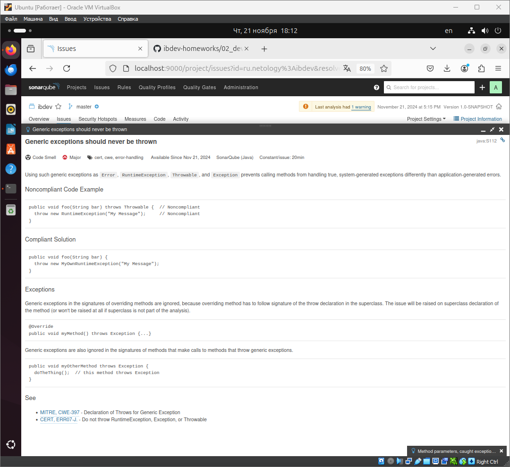
    5. * **Описание**: Define and throw a dedicated exception instead of using a generic one. (Определите и сгенерируйте специальное исключение вместо использования общего.)
       * **Почему SonarQube считает Security Hotspots**: Using such generic exceptions as Error, RuntimeException, Throwable, and Exception prevents calling methods from handling true, system-generated exceptions differently than application-generated errors. (Использование таких универсальных исключений, как Error, RuntimeException, Throwable и Exception, не позволяет вызывающим методам обрабатывать истинные системные исключения иначе, чем ошибки, генерируемые приложением.)
       * 